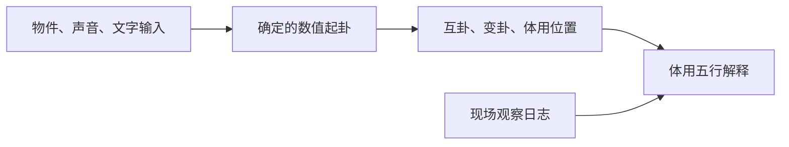

# 梅花易数技能包

旧题邵雍，维基文库传本；成书与传本年代未作确定考证。2026-09-07 整理。主旨：把数、象与现场观察转换成可复核的传统解读过程。

## 入口

- [精华阅读](DIGEST.md)
- [共享术语](GLOSSARY.md)
- [整书理解](BOOK_OVERVIEW.md)
- [规则版本及勘误](RULE_NOTES.md)
- [筛选记录](verified.md)

## 五个技能

- [梅花数值起卦](meihua-numeric-cast/SKILL.md)：按已确认的传统年月日时序数、物数和时数计算梅花易数上下卦及动爻（numeric cast）。输入已经是数值时调用；仅提供六爻求互变、记录环境或解释五行时交给相邻技能。
- [梅花观察输入与取数](meihua-observation-input/SKILL.md)：用户主动把物件、敲击声或文字作为梅花起卦材料时，记录事实并确定计数方案（observation input）。已明确给出数字只需计算时用 meihua-numeric-cast；仅记环境而不新起卦时用 meihua-context-log。
- [梅花互卦与变卦](meihua-hexagram-structure/SKILL.md)：已给上下卦或自下向上的六爻和一个动爻，要求求互卦、变卦、体用位置（hexagram structure）时调用。未起卦的时间/数值输入先用 meihua-numeric-cast；只解释五行关系用 meihua-body-use。
- [梅花体用关系解释](meihua-body-use/SKILL.md)：已有体卦、用卦等结构，要求解释五行生克、比和及有明确时令依据的旺衰（body-use analysis）时调用。尚需起卦或计算互变交给数值/结构技能；单纯查天气不调用。
- [梅花现场观察与复盘](meihua-context-log/SKILL.md)：用户主动为已有梅花卦记录或复盘真实环境事件、耳目心观察及内外解释分歧（context log）时调用。不为用户新采集音视频；需要由声音或物件新起卦时用 meihua-observation-input。

## 组合顺序



已有数值可以直接进入数值技能，已有卦可以直接进入结构技能。日志按用户意愿添加，不要求重新起卦。取象和日志的区别是“要不要用观察生成新卦”。

## 本地调用

技能构建产物保留在本目录；项目内的安装副本位于 `.agents/skills/`。开发代理可从相应 SKILL.md 读取调用；发现/加载行为取决于宿主是否刷新本项目技能。网站第一阶段由 `scripts/meihua-display.mjs` 调用确定性计算核心，并把结果传给页面与 Qwen；Qwen API 不会自动读取磁盘技能。

数值计算可直接运行：

```js
import {castTimeOrdinals} from './meihua-numeric-cast/scripts/meihua.mjs';
const result=castTimeOrdinals({yearBranch:5,month:12,day:17,hourBranch:9});
// 上兑、下离，初爻动；互下巽上乾，变下艮上兑。
```

校验命令（项目根目录）：`node scripts/verify-meihua.mjs`。

每个技能附 test-prompts.json 和 test-results.md，保留行为测试；不声称已运行未安装的 darwin 平台。候选和 rejected/ 为审计材料，以正式技能和 RULE_NOTES.md 为准。
